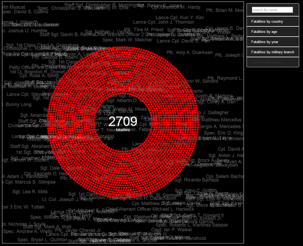

# D3 Data Visualizations

This project contains example visualizations using D3.js JavaScript library.

* [Democrats vs Republicans](https://rawgithub.com/timmhayes/data-visualization/master/projects/election_2012/election-chart.html): A scatter plot of the 2012 U.S. presidential election results by county, matched against demographic data such as population, education, welfare, and income. Are Republicans the party of the rich?  

* [The Cost of War](https://rawgithub.com/timmhayes/data-visualization/master/projects/the_cost_of_war/chart.html): Exploring the 6776 U.S soldiers who have died in Iraq and Afghanistan between 2001 and 2014.  

* [Who Guns Kill](https://rawgit.com/timmhayes/data-visualization/master/projects/guns/gun-deaths-us.html): 
The highest rates of gun violence are not where you think.  

